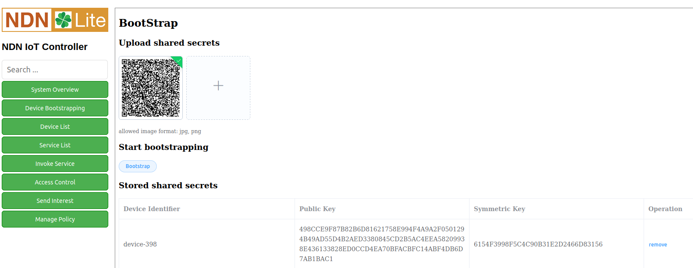
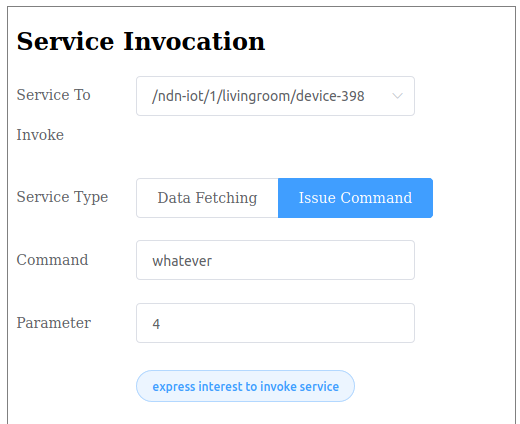

Quickstart Examples
========

The ndn-lite-docker-image_ has NFD and IoT System Controller pre-installed. It is **highely recommanded** to use it to save time.
If it's used as your development environment, please skip to `Share QR Code and bootstrap Device`_.

.. _ndn-lite-docker-image: install.html#docker-image

Preparation
--------------
If you're using Docker image, no more preparation is needed and please skip to `Share QR Code and bootstrap Device`_.
If you're not using Docker image and start your build on macOS, additional software are required. 

#. `Get Started with ndn-cxx`_
#. `Get Started with NFD`_

.. _Get Started with ndn-cxx: https://named-data.net/doc/ndn-cxx/current/INSTALL.html
.. _Get Started with NFD: https://named-data.net/doc/NFD/current/INSTALL.html

Start your NFD:

.. code-block:: bash

    $ nfd-start

Notice: Please build ndn-cxx and NFD from source.

Download and execute ndn-iot-controller_:

.. code-block:: bash

    $ cd /path/to/controller
    $ git clone http://github.com/named-data-iot/ndn-iot-controller

.. _ndn-iot-controller: http://github.com/named-data-iot/ndn-iot-controller

Install dependencies (if you're using macOS or brew):

.. code-block:: bash

    $ brew install zbar leveldb

Set up development environment:

.. code-block:: bash

    $ python3 -m venv ./venv
    $ ./venv/bin/python -m pip install -r requirements.txt

Run the controller server:

.. code-block:: bash

    $ ./venv/bin/python app.py

Share QR Code and bootstrap Device
-------------

**Top posting: If you feel difficulties in finding those pre-generated QR code, you can simply download from our** repo_

.. _repo: https://github.com/named-data-iot/ndn-iot-package-over-posix/tree/master/devices

<project-root> is the ``ndn-iot-package-over-posix`` directory.
If you're already in container's root path, you need

.. code-block:: bash

    $  cd ndn-iot-package-over-posix

to go into the project root.

Devices in smart homes, need to be boostrapped by a IoT controller to obtain credentials.
Thus the IoT controller should have some shared secrets between it and devices to validate bootstrap request.
The shared secrets, in our project, are in two formats: a txt file that be loaded by device program, and a QR code that be uploaded to IoT controller by users.
Three pairs of pre-generated shared secrets are in folder ``/<project-root>/devices``.
Device programs in ``/<project-root>/examples`` will use two of them.

Hard-coded bindings between example device program and QR code are:

    +----------------------+----------------------------+
    | Device Program       | Pre-generated QR Code      | 
    +======================+============================+
    | tutorial-app         | device-398.png             |
    +----------------------+----------------------------+
    | tutorial-app-sub     | device-24777.png           |
    +----------------------+----------------------------+

Additionally, you can generate shared secrets by following instructions :ref:`shared-secrets-label`.

Now it's time bring your devices online.

Open controller's UI in browser at ``127.0.0.1:6060``, then click ``Device Bootstrapping`` button, a blank for uploading QR code should show up, as shown in the following picture.

We upload ``device-398.png`` to the blank, and click ``bootstrap`` button, which enable controller waiting for bootstrapping request in the following 5 seconds.

Now run the corresponding device program inside this 5-second bootstrapping window:

.. code-block:: bash

    $ cd /<project-root>/build
    $ ./examples/tutorial-app

In this process, controller may ask for ``sudo``, please give our access.

This ``device-398`` has two functions:

#. Subscribe to LED command and adjust illuminance value based on command content
#. Publish a string ``hello`` to a pre-defined topic every 400000ms

**Note:** When you stop a running ndn-lite application or disconnected a device and want to reconnect, you have to re-bootstrap the device. Before that, please **delete the device from the controller**. To do so, please use the "device list" page in controller and hit ``remove``. As shown in the image below.
Failure to do so will crash the application with ``TLV Type (should be TLV_AC_KEYID) not correct`` error.

.. image:: images/delete_device.png
  :width: 800
  :alt: The device list UI

Play with Example Command
--------------

Click ``Invoke Service`` button, you shall see a form asking for interested service and command parameters:

Given now only one device has been bootstrapped, only one ``service`` can be selected. 
Then, select ``Issue Command``.
Input any ``command`` id and input an integer between 0 and 100 as the ``parameter``. This command is supposed to send LED brightness to the device. Send command by clicking ``express interest to invoke service``, in the terminal which runs tutoriala-app, device side result should show.

Fetch a Published Content
--------------

Following similar steps with bootstrapping ``device-398`` (please do not kill it), we can bootstrap ``device-24777`` to the controller in another terminal by running ``tutorial-app-sub``.
This device subscribes to the pre-defined topic where ``device-398`` publishes its string.
After a while, the ``hello`` string should appeer in the terminal.